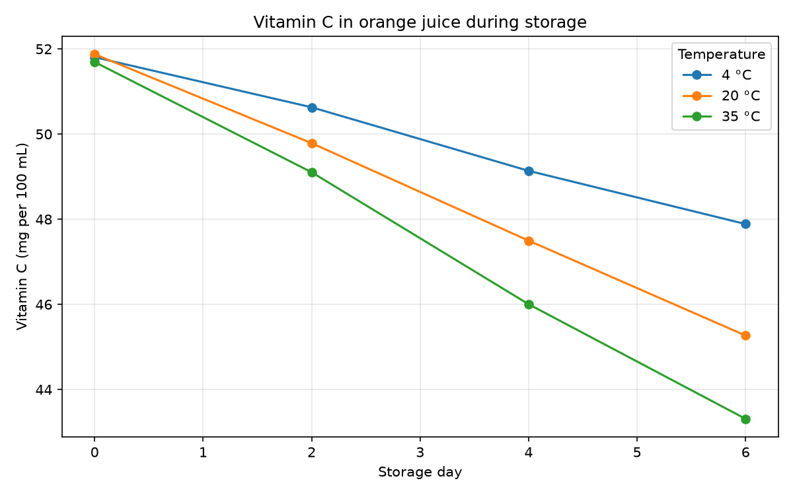
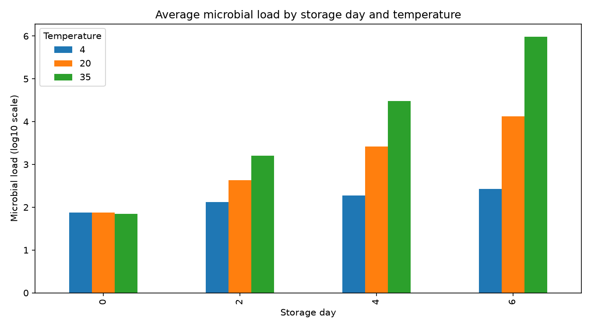
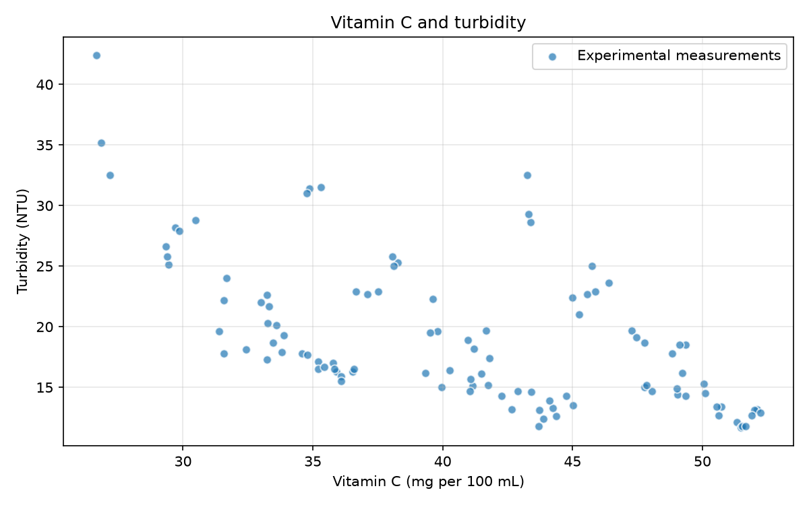

# BSEN10040 — Python Data Analysis

  <strong>Fruit juice storage: from a CSV table to analysis results</strong> 
  Python · pandas · Matplotlib · synthetic food science data

  <a href="fruit_juice_storage_analysis.ipynb">Analysis notebook</a>
  ·
  <a href="data/fruit_juice_storage.csv">Dataset</a>
  ·
  <a href="outputs">Output figures</a>

This example explores how vitamin C and microbial load vary with storage time and temperature in a synthetic fruit juice dataset. The figures below are saved outputs from the notebook run.

## Results gallery

Click a figure to view the full-size image.

<table>
  <tr>
    <td align="center" width="33%">
       
      <b>Vitamin C over time</b> Orange juice · mean of 3 batches
    </td>
    <td align="center" width="33%">
       
      <b>Microbial load</b> Storage day × temperature
    </td>
    <td align="center" width="33%">
       
      <b>Vitamin C vs turbidity</b> 106 complete sample pairs
    </td>
  </tr>
</table>

- **Line chart:** vitamin C decreases over storage time in orange juice, with a steeper decline at higher temperatures in these synthetic data.
- **Grouped bar chart:** mean microbial load increases with storage time, especially at 35 °C. Each bar averages the log10 values across all three juice types and three batches.
- **Scatter plot:** lower vitamin C values generally coincide with higher turbidity, with visible variation across samples. The plot combines juice types and storage conditions; it does not establish causation.

## Dataset shape and structure

The [CSV file](data/fruit_juice_storage.csv) contains **108 rows × 9 columns**. Each row represents one sample for a particular juice type, temperature, storage day and batch.

**3 juice types × 3 temperatures × 4 storage days × 3 batches = 108 samples**

| Experimental factor | Values |
|---|---|
| Juice type | Orange, apple, berry |
| Storage temperature | 4, 20, 35 °C |
| Storage day | 0, 2, 4, 6 |
| Batch | 1, 2, 3 |

The table has **2 text columns, 3 integer columns and 4 decimal-valued columns**.

| Column | Type | Meaning / unit | Non-missing |
|---|---|---|---:|
| `sample_id` | Text | Unique sample label | 108 |
| `juice_type` | Text | Juice category | 108 |
| `storage_temp_C` | Integer | Temperature, °C | 108 |
| `storage_day` | Integer | Storage time, days | 108 |
| `batch` | Integer | Batch number | 108 |
| `vitamin_c_mg_per_100ml` | Decimal | Vitamin C, mg per 100 mL | 108 |
| `pH` | Decimal | pH | 106 |
| `microbial_load_log10` | Decimal | Microbial load, log10 CFU/mL | 108 |
| `turbidity_NTU` | Decimal | Turbidity, NTU | 106 |

### Data preview

The first three rows of the CSV:

| sample_id | juice_type | storage_temp_C | storage_day | batch | vitamin_c_mg_per_100ml | pH | microbial_load_log10 | turbidity_NTU |
|---|---|---:|---:|---:|---:|---:|---:|---:|
| S001 | orange | 4 | 0 | 1 | 52.11 | 3.62 | 1.90 | 13.2 |
| S002 | orange | 4 | 0 | 2 | 51.32 | 3.62 | 1.86 | 12.1 |
| S003 | orange | 4 | 0 | 3 | 51.99 | 3.63 | 1.91 | 13.1 |

## Inspection and cleaning results

| Notebook result | Shape | Description |
|---|---|---|
| Original data, `df` | `(108, 9)` | All samples and variables |
| Orange juice subset, `orange_df` | `(36, 9)` | Orange juice samples only |
| Cleaning example, `clean_df` | `(104, 9)` | Rows missing pH or turbidity removed |
| Vitamin C summary, `summary` | `(9, 3)` | One mean per juice type and temperature |
| Scatter plot data, `scatter_df` | `(106, 2)` | Complete vitamin C–turbidity pairs |

There are **2 missing pH values** (`S011`, `S071`) and **2 missing turbidity values** (`S026`, `S091`). All other columns are complete.

The separate cleaning example removes four rows. The summary and plots start from the original data and select the variables needed for each calculation, so missing pH does not remove usable vitamin C observations.

Sample **S108** contains an intentionally high microbial-load value of **7.80**, with turbidity **42.4 NTU**. It remains in the plotted data.

## Vitamin C summary

Mean vitamin C concentration (**mg per 100 mL**), grouped by juice type and storage temperature. Each value averages **12 samples across all four storage days and three batches**.

| Juice type | 4 °C | 20 °C | 35 °C |
|---|---:|---:|---:|
| Apple | 41.90 | 40.57 | 39.73 |
| Berry | 34.08 | 32.63 | 31.44 |
| Orange | 49.86 | 48.61 | 47.53 |

In this dataset, orange juice has the highest mean vitamin C at each temperature. All three juice types have lower overall means at warmer storage temperatures.

## Repository files

| File / folder | Contents |
|---|---|
| [Analysis notebook](fruit_juice_storage_analysis.ipynb) | Data inspection, cleaning, grouped summaries and plotting code |
| [CSV dataset](data/fruit_juice_storage.csv) | 108 synthetic samples and 9 variables |
| [Dataset generator](data/generate_fruit_juice_storage.py) | Script used to generate the teaching data |
| [Output figures](outputs) | Three PNG figures displayed above |

**Data note:** all values are synthetic and intended for teaching. The displayed patterns are not validated laboratory findings or food-safety guidance.
